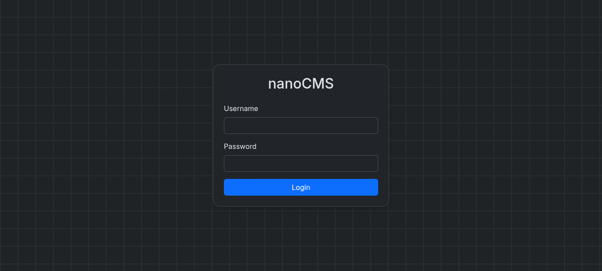
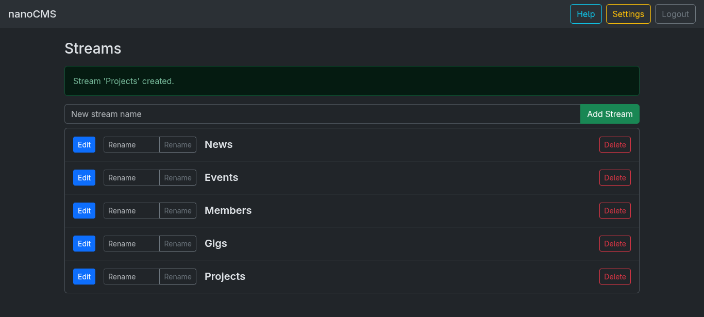
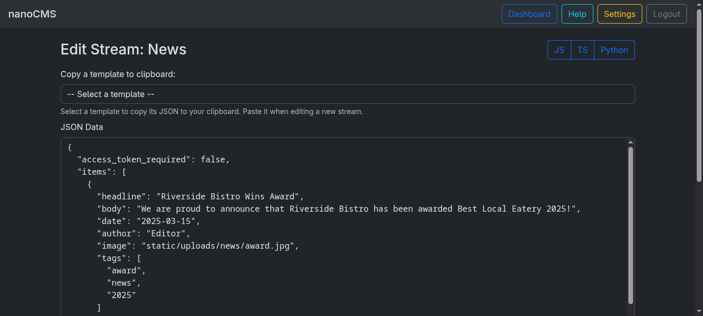
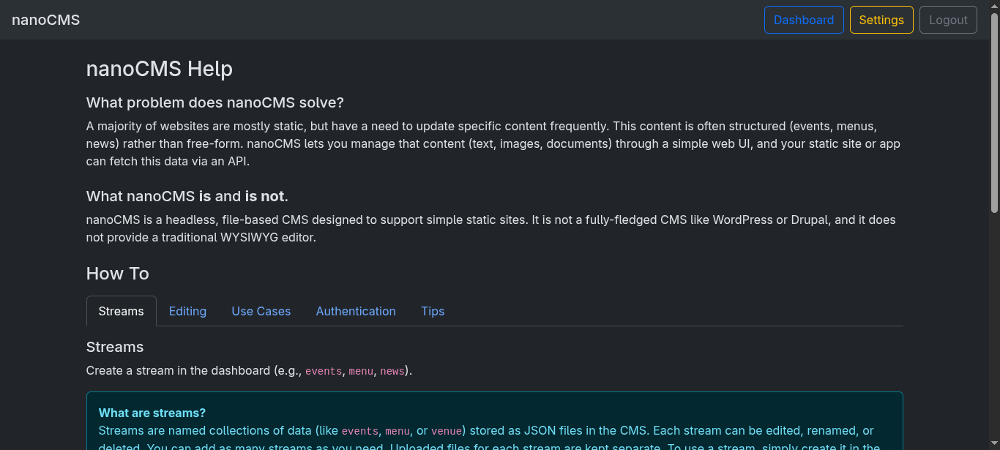
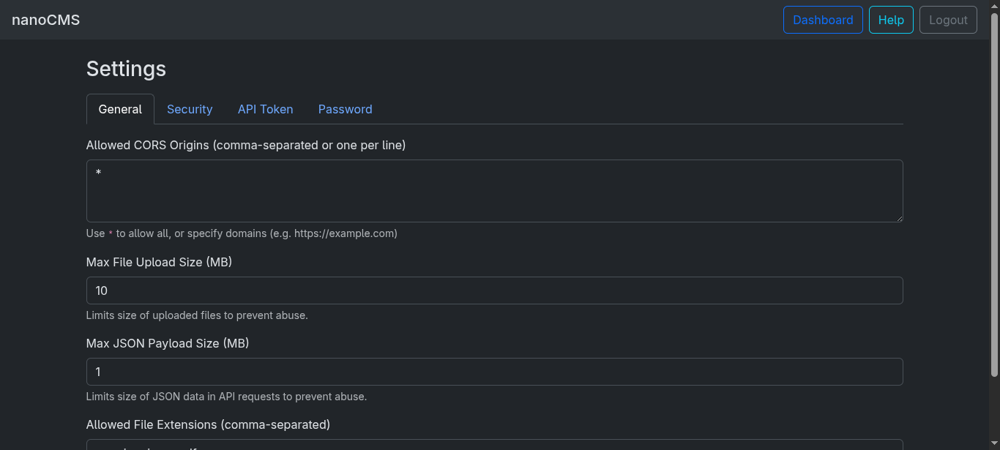

# nanoCMS 🐍

**nanoCMS** is a lightweight CMS written in Python using Flask. It is designed for simplicity, low hosting requirements, and easy integration with static sites. You can create and manage JSON-based "streams" of data (like events, menus, or venue info) through a web interface, and access them via a RESTful API.

> [!INFO]
> This project was originally created as a simple CMS for a shared hosting environment. It may still eventually grow more features, but for now it focuses on being minimal and easy to use.

## Screenshots







## Features

- Provides REST-style API to fetch stream data
- File-based and easily deployable on low-cost shared or VPS hosting
- Editable "streams" (e.g. `events`, `venue`, `menu`) from the browser
- Supports text, file, and image upload from the UI (png, jpeg, and pdfs)
- Security features:
  - Basic login authentication
  - Stream-level access control (Bearer token)
  - Password hashing with bcrypt
  - CSRF protection for all forms
  - HTTPS enforcement for token-protected endpoints
  - Rate limiting to prevent abuse
- Settings management
  - CORS support for API endpoints (you can set allowed origins)
  - Allow custom file extensions for uploads
  - Change admin password from the UI
  - Change access token from the UI

## How Do Streams Work?

- Streams are just JSON files in the `data/` folder (e.g. `data/events.json`).
- Each stream can have any structure you want - add fields, rules, expiry dates, etc.
- Uploaded files for each stream are stored in `static/uploads/<stream>/`.
- The dashboard lets you add, rename, or delete streams safely.
- Change indicator shows when you have unsaved edits in the editor.

**Example stream:**
```json
[
  {
    "title": "Jake Morley and the Frenetic 4",
    "date": "2025-05-30",
    "image": "static/uploads/events/art-jake-morley-01.jpg",
    "expiry": "2025-06-01",
    "tags": ["music", "live"]
  }
]
```

**Tips:**
- You can add any fields you want (e.g. `expiry`, `rules`, `tags`).
- Your frontend can use these fields for filtering, display, or logic.
- To reference an uploaded file, use `static/uploads/<stream>/<filename>` in your JSON.

## Quickstart

> [!CAUTION]
> While this code is functional, it may contain bugs and lacks extensive testing. Use at your own risk, especially in production environments.

### Requirements
- Python 3.11+
- [uv](https://github.com/astral-sh/uv) (for fast dependency management, or use pip)

### Installation
Clone the repo and install dependencies:

```bash
git clone https://github.com/m-spangenberg/nanocms.git
cd nanocms
uv sync  # or: pip install -r requirements.txt
```

### Configuration

The app automates the initial setup. On first run, it creates a `data/` folder and generates a random admin password (printed to the console and saved in `data/first_start_pw.txt`).

### Running the App
```bash
uv run application.py  # or: python application.py
```
Visit [http://localhost:5000](http://localhost:5000) in your browser.

## Troubleshooting

- **Can't log in?** Use `admin` and the generated password from the console on first run. The password is also saved in `data/first_start_pw.txt`.
- **File upload not working?** Ensure `static/uploads/` is writable.
- **App won't start?** Check Python version and dependencies.
- **Want to reset?** Delete or edit files in `data/` and `static/uploads/`.
- **CSRF errors?** Make sure all POST forms include the CSRF token as a hidden input.
- **Token errors?** Ensure you are using HTTPS and sending the correct Bearer token in requests.

## Admin Password Setup and Reset

- On first run, nanoCMS generates a random admin password and prints it to the console.
- The password is also saved in `data/first_start_pw.txt` until you log in and set a new password.
- **First login:** Use the generated password. You will be required to set a new password immediately.
- **Lost password?**
  Delete `data/admin_pw_hash.txt` and restart the app. A new random password will be generated and printed to the console.

## Changing the Admin Password

- After logging in, go to the Settings page and use the "Change Password" form.
- You must enter your current password and the new password (twice to confirm).
- The password must be at least 8 characters long.

## Contributing

Pull requests and issues are welcome! For major changes, please open an issue first to discuss what you’d like to change.

## Acknowledgements

- Uses [highlight.js](https://highlightjs.org/) for code editing in the browser.
- Uses [bootstrap](https://getbootstrap.com/) for responsive UI design.

## License

MIT
